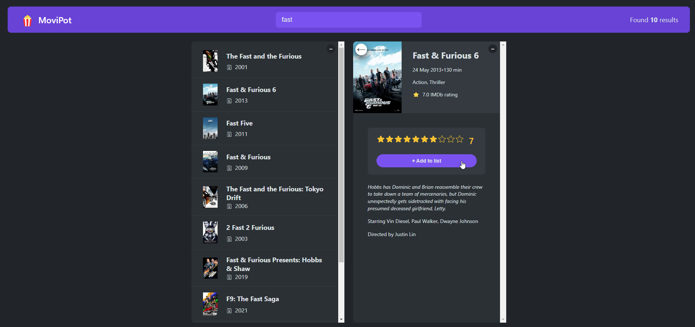
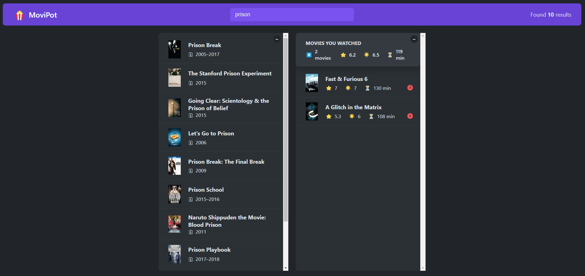

# MoviPot

MoviPot is a React-based movie rating application that allows users to browse and rate movies. The project is built with React 19 and leverages custom hooks for state management.




## Table of Contents

- [Features](#features)
- [Project Structure](#project-structure)
- [Installation](#installation)
- [Usage](#usage)
- [Scripts](#scripts)
- [Technologies Used](#technologies-used)
- [License](#license)

## Features

- Browse movie listings
- Rate movies using a star rating system
- Persist user ratings with local storage
- Keyboard shortcuts support

## Project Structure

```
.
├── README.md
├── index.css
├── package-lock.json
├── package.json
├── public
│ ├── favicon.ico
│ ├── index.html
│ ├── logo192.png
│ ├── logo512.png
│ ├── manifest.json
│ ├── movi-pot-1.png
│ ├── movi-pot-2.png
│ └── robots.txt
└── src
├── App-v1.js
├── App-v2.js
├── App.js
├── StarRating.js
├── index.css
├── index.js
├── useKey.js
├── useLocalStorageState.js
└── useMovies.js
```

## Installation

To set up the project locally, follow these steps:

1. Clone the repository:

```bash
   git clone https://github.com/yourusername/movipot.git
   cd movipot
```

2. Install dependencies:

```bash
npm install
Start the development server:
```

3. Start the development server:

```bash
npm start
```

## Usage

Once the server is running, open [http://localhost:3000](http://localhost:3000) in your browser to view the application.

## Scripts

The following npm scripts are available:

- `npm start` - Runs the app in development mode.
- `npm run build` - Builds the app for production.
- `npm test` - Runs tests.
- `npm run eject` - Ejects the application (use with caution).

## Technologies Used

- **React 19** - Frontend library
- **React Hooks** - State management
- **CSS** - Styling
- **Local Storage** - Data persistence

## License

This project is licensed under the MIT License.
